# Чек листы ads.vk.com <!-- omit from toc -->

- [Настройки](#настройки)
  - [Общие](#общие)
  - [Уведомления](#уведомления)
  - [Права доступа](#права-доступа)
  - [История изменений](#история-изменений)
- [Создание лид-формы](#создание-лид-формы)
  - [Оформление](#оформление)
  - [Вопросы](#вопросы)
  - [Результаты](#результаты)

## Настройки

Раздел находится по [ссылке](https://ads.vk.com/hq/settings).

- При нажатии на кнопку `Настройки` в боковом меню пользователь переходит в раздел [Общие](#общие) настроек.

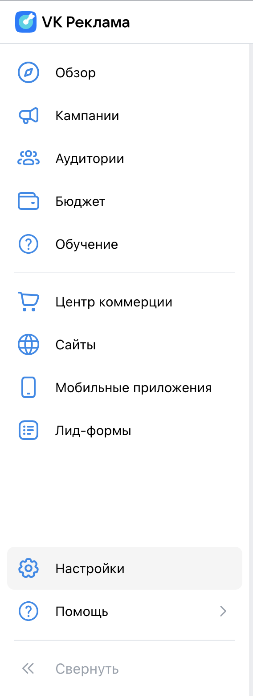

### Общие

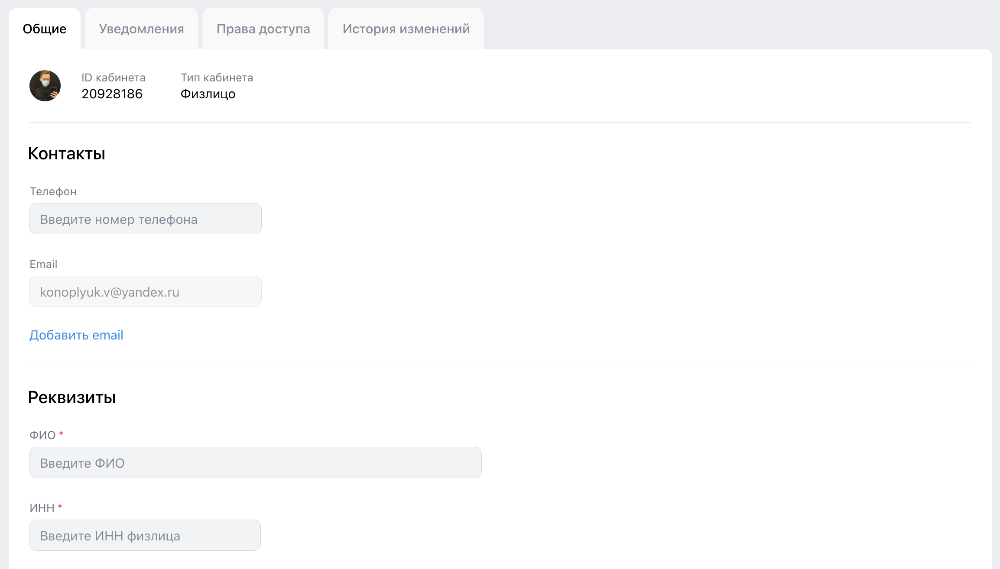

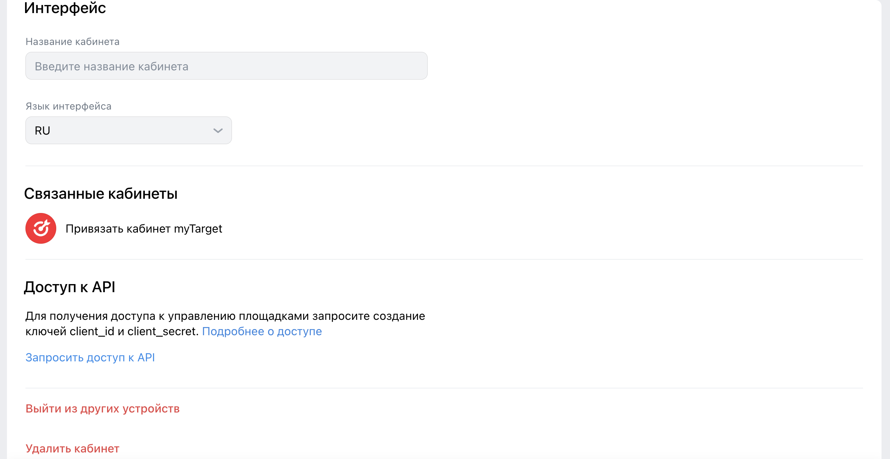

- При вводе данных в каждом из полей, внизу страницы появляются кнопки `Сохранить`, `Отменить`.
- При нажатии на кнопку `Сохранить` все введенные данные в полях валидируются.
  - При наличии ошибок в соответствующих полях появляется сообщение об ошибке и поле подсвечивается красным цветом.
  - В момент, когда ошибка исправлена, сообщение пропадает.
  - При при отсутствии ошибок все данные сохраняются.
- При нажатии на кнопку `Отменить` все введенные изменения отменяются.

- `Телефон`

  - Валидный телефон имеет формат `+<код страны><код оператора><уникальный номер>`:
    - `<код страны>` - международный код страны;
    - `<код оператора>` - 3 цифры, обозначающих название сотового оператора и регион регистрации номера;
    - `<уникальный номер>` - 7 уникальных цифр, номер абонента, по которому также можно определить регион.
  - При попытке оставить поле пустым ошибки не возникает
  - При попытке ввести данные в любом другом формате, возникает ошибка `Некорректный номер телефона`.
  - При попытке ввести более 14 символов в поле остаются только первые введенные 14 символов.

- `Email`

  - Валидный email имеет формат: `<username>@<domain>.<TLD-name>`:
    - `<username>` - уникальное имя пользователя:
      - непустое
      - может содержать латинские символы, цифры
      - не может содержать следующих символов `<>,":;[]@`
    - `<domain>` - доменное имя:
      - непустое
      - может содержать латинские символы, цифры
      - не может содержать следующих символов `<>,":;[]@`
    - `<TLD-name>` - доменное имя верхнего уровня
      - минимум 2 символа
      - содержит только латинский буквы
    - email не может содержать более 2-х точек подряд.
  - Если почта уже указана, то существующее значение почты нельзя изменить
  - При нажатии на кнопку `Добавить email` снизу появляется новое пустое поле, справа которого находится кнопка "крестик", при нажатии на которую поле удаляется.
    - При нажатии на кнопку `Сохранить` с пустым полем появляется ошибка `Обязательное поле`.
    - При вводе невалидной почты появляется ошибка `Некорректный email адрес`.
    - При попытке ввести более 255 символов в поле остаются только первые введенные 255 символов.

- `ФИО`

  - Может содержать только кириллические символы, дефис и пробел.
  - При попытке ввести невалидные символы возникает ошибка `Некорректные символы. Разрешена только кириллица дефис и пробел`.
  - При попытке оставить поле пустым появляется ошибка `Обязательное поле`
  - При попытке ввести только пробелы возникает ошибка `Значение не может содержать только пробелы`.
  - При попытке ввести более 255 символов в поле остаются только первые введенные 255 символов.
  - При попытке ввести несколько пробелов между словами, все пробелы сокращаются до одного.
  - При попытке ввести пробелы в начале и в конце данных они остаются без изменений.
  - При вводе любых других данных ошибки не возникает.

- `ИНН`

  - Валидный ИНН физического лица имеет формат: `<код-налогового-органа><номер-налоговой-записи><контрольное-число>`:
    - `<код-налогового-органа>` - код налогового органа, который присвоил ИНН: 4 цифры
    - `<номер-налоговой-записи>` - номер налоговой записи налогоплательщика в территориальном разделе ЕГРН: 6 цифр
    - `<контрольное-число>` - контрольное число для проверки правильности номера: 2 цифры, подробнее про контрольное число [тут](https://ru.wikipedia.org/wiki/%D0%9A%D0%BE%D0%BD%D1%82%D1%80%D0%BE%D0%BB%D1%8C%D0%BD%D0%BE%D0%B5_%D1%87%D0%B8%D1%81%D0%BB%D0%BE#%D0%9D%D0%BE%D0%BC%D0%B5%D1%80%D0%B0_%D0%98%D0%9D%D0%9D)
  - При попытке оставить поле пустым появляется ошибка `Обязательное поле`.
  - При вводе 12 цифр ошибки не возникает.
  - При попытке ввести цифр в количестве до 12 штук возникает ошибка `Длина ИНН должна быть 12 символов`.
  - При попытке ввести более 12 символов в поле остаются только первые введенные 12 символов.
  - При попытке ввести невалидный ИНН (некорректное контрольное число) возникает ошибка `Невалидный ИНН`.
  - При попытке ввести символы, отличные от цифр, возникает ошибка `Некорректный ИНН`.

- `Название кабинета`

  - Валидное название:
    - может содержать любые символы, кроме одних пробелов
  - При попытке ввести только пробелы возникает ошибка `Значение не может содержать только пробелы`.
  - При попытке ввести пробелы в начале и в конце данных все эти пробелы убираются.
  - При попытке ввести более 255 символов в поле остаются только первые введенные 255 символов.
  - При вводе любых других данных ошибки не возникает.

- `Язык интерфейса`

  - При нажатии на раскрывающийся список появляется два пункта: `RU` и `EN`.
  - При нажатии на пункт возле него появляется галочка.

- `Связанные кабинеты`

  - При нажатии на кнопку `Привязать кабинет myTarget` появляется модальное окно с информацией о привязке кабинета MyTarget.

- `Доступ к API`

  - При нажатии на ссылку `Подробнее о доступе` пользователя перенаправляет на [страницу помощи](https://ads.vk.com/help/articles/help_api).
  - При нажатии на кнопку `Запросить доступ к API` появляется модальное окно с формой:
    - Снизу формы кнопки `Запросить доступ` и `Отмена`.
    - При хотя бы одном незаполненном поле кнопка `Запросить доступ` неактивна.
    - При нажатии на активную кнопку `Запросить доступ` поля валидируются (при наличии ошибок показываются сообщения) и информация отправляется.
    - При нажатии на кнопку `Отмена` модальное окно закрывается. При повторном открытии все внесенные данные отображаются по-новой.
    - `ФИО ответственного лица`
      - Про валидное ФИО описано выше.
      - При попытке ввести только пробелы возникает ошибка `Некорректное имя`.
      - При вводе любых других данных ошибки не возникает.
    - `Контактный телефон`
      - Про валидный номер телефона описано выше.
      - При попытке ввести невалидный номер телефона появляется сообщение об ошибке `Некорректный формат. Пример: +71234567890`.
      - При попытке ввести валидный номер телефона ошибок не возникает.
    - `Email`
      - Про валидную почту описано выше.
      - При попытке ввести невалидную почту появляется сообщение об ошибке `Некорректный формат. Пример: example@mail.ru`.
      - При попытке ввести валидную почту ошибок не возникает.

- При нажатии на кнопку `Выйти из других устройств` снизу слева появляется сообщение `Активные сеансы на других устройствах успешно завершены.`.
- При нажатии на кнопку `Удалить кабинет` появляется модальное окно с подтверждением удаления кабинета.

### Уведомления

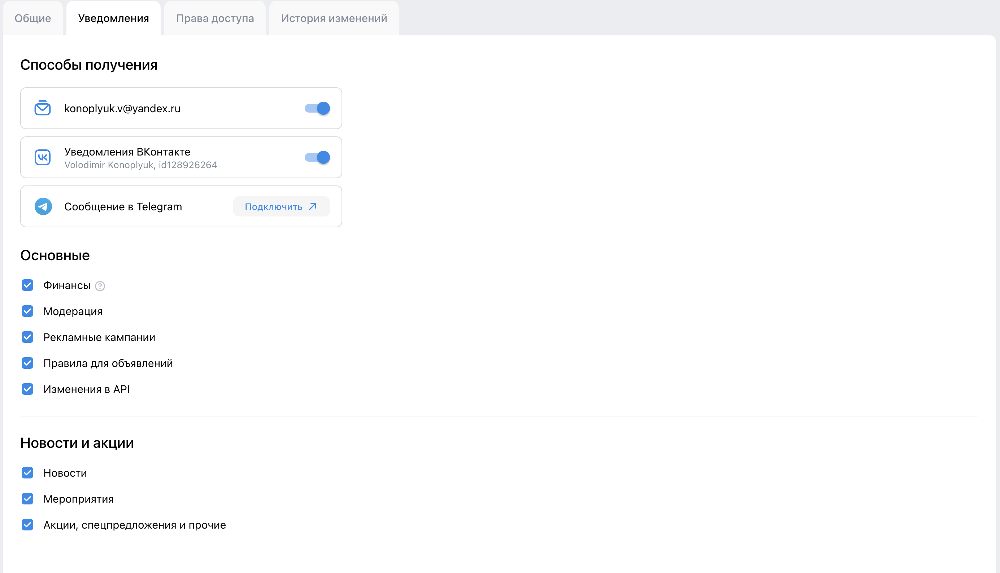

- При изменении любого пункта (чекбокс, переключатель) внизу страницы появляются кнопки `Сохранить`, `Отменить`.
- При отключении всех способов получения уведомлений:
  - внизу раздела `Способы получения` появляется сообщение `Уведомления выключены`;
  - Все чекбоксы в разделах `Основные` и `Новости и акции` становятся неактивными (их нельзя переключить).
- При отключении всех чекбоксов в разделах `Основные` и `Новости и акции` кнопка `Сохранить` становится неактивной.
- При нажатии на кнопку `Сохранить` все данные сохраняются.

### Права доступа

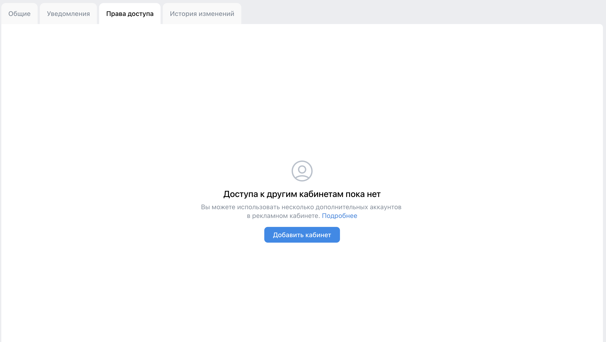

- При нажатии на ссылку `Подробнее` пользователя перенаправляет на [страницу помощи](https://ads.vk.com/help/articles/additionalaccounts).
- При нажатии на кнопку `Добавить кабинет` появляется модальное окно `Добавление кабинета` с формой.
  - `ID аккаунта VK Рекламы`
    - При попытке ввести любые данные, кроме цифр, данные не вводятся.
    - При попытке ввести более 10 цифр в поле остаются только первые введенные 10 цифр.
    - При вводе неверного id (например 7) появляется сообщение об ошибке `Не нашли такой аккаунт. Проверьте, правильно ли введён ID`.
  - `Правa доступа`
    - При выборе одной из радио кнопок под соответствующей появляются два чекбокса `Доступ к кампаниям` и `Доступ к финансовой информации`.
    - При попытке снять отметку последнего выбранного чекбокса он не отключается.
  - При нажатии на кнопку `Сохранить` поля валидируются (при наличии ошибок показываются сообщения) и информация сохраняется.
  - При нажатии на кнопку `Отмена` все данные удаляются и модальное окно закрывается.

### История изменений

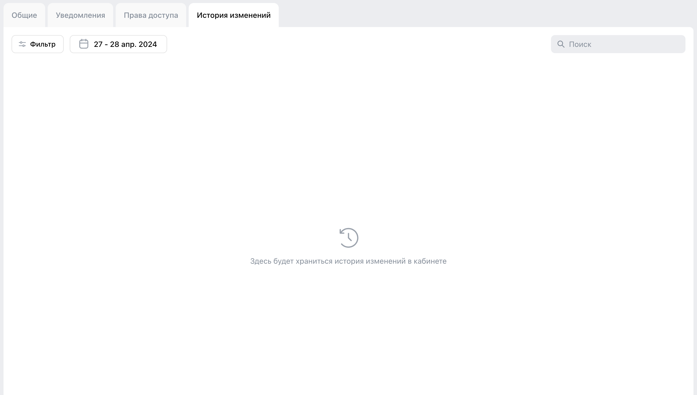

- При нажатии на кнопку `Фильтр` появляется выпадающее окно с выбором фильтров.
  - В выпадающем окне есть три раздела `Тип объекта`, `Что изменилось`, `Автор изменения`.
  - Снизу окна есть кнопки `Отмена` и `Применить`.
  - Сверху справа есть кнопка `Выбрать все`, при нажатии на которую все чекбоксы данного раздела выбираются.
  - В каждом из разделов есть чекбоксы, при выборе хотя бы одного слева внизу окна появляется кнопка `Сбросить все`, а также справа сверху вместо кнопки `Выбрать все` появляется кнопка `Сбросить`.
  - При переключении между разделами при выбранных чекбоксах в одном из разделов кнопка `Сбросить` отображается только для раздела с выбранными чекбоксами.
  - При нажатии на кнопку `Сбросить` чекбоксы сбрасываются только в текущем разделе.
  - При нажатии на кнопку `Сбросить все` все выбранные чекбоксы во всех разделах сбрасываются.
  - При нажатии на кнопку `Применить` все выбранные фильтры применяются.
    - При этом на основной странице сверху появляются теги примененных фильтров.
    - Если фильтров несколько, то дополнительно рядом появляется кнопка `Сбросить все`.
  - При нажатии на кнопку `Отмена` все выбранные фильтры отменяются.
  - При вводе слова в поиске остаются чекбоксы, соответствующие запросу.
- При нажатии на кнопку с календарем появляется выпадающее окно с выбором промежутка времени, за который отображается история изменений в кабинете.
  - При попытке вводить невалидного дня месяца или года в полях итоговая дата в поле будет меняться на ближайшую валидную.
  - При попытке ввести дату `до` меньшую чем дату `после` даты автоматически меняются местами (меньшая становится `до`, большая - `после`).

## Создание лид-формы

Раздел создания лид-формы по-умолчанию выглядит следующим образом:

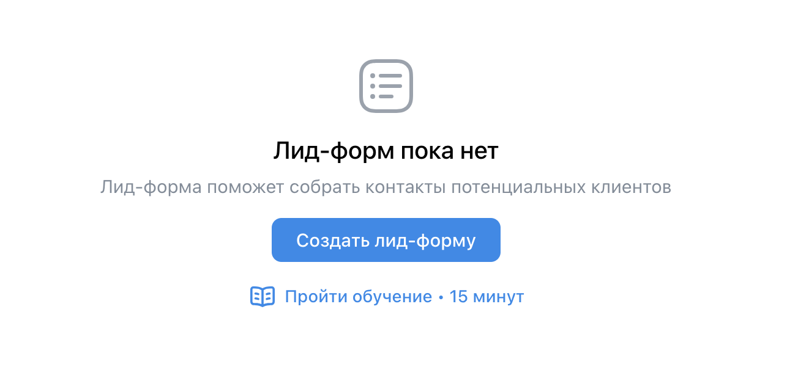

При нажатии на кнопку `Создать лид-форму`, справа появляется модальное окно с формой создания лид-форма на первом шаге.

### Оформление

Первый шаг `Оформление` выглядит следующим образом:

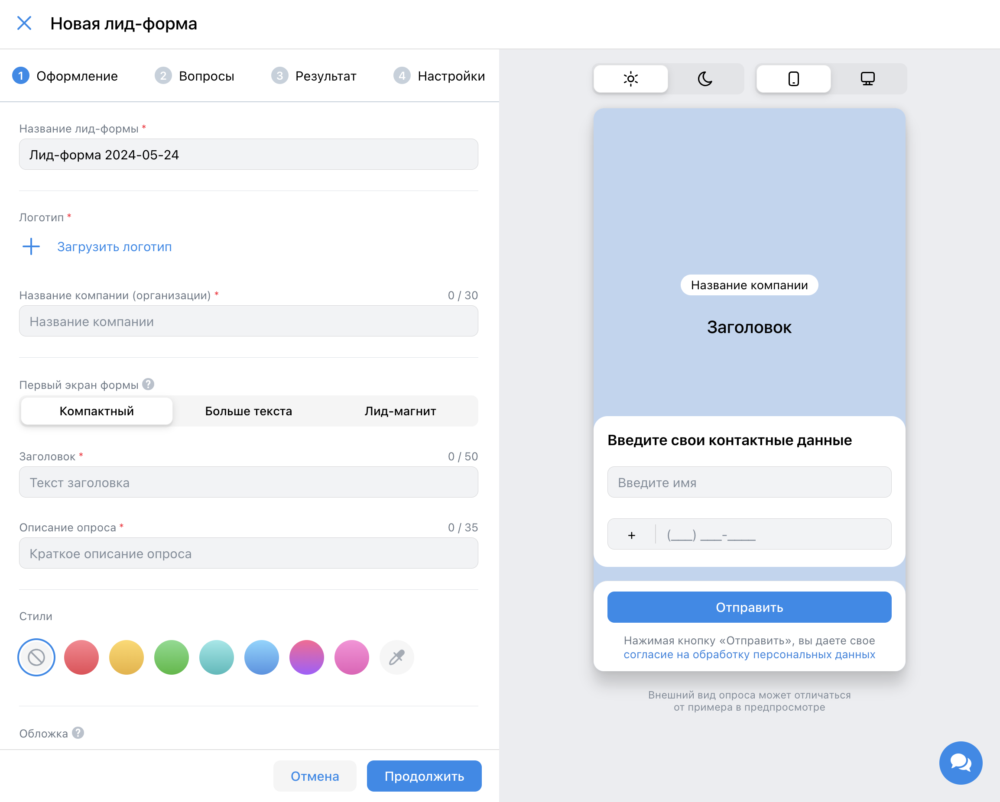

- снизу формы кнопки `Продолжить` и `Отмена`
  - при нажатии на кнопку `Продолжить` происходит валидация форм
    - при наличии ошибок в соответствующих полях появляется сообщение об ошибке
    - в момент, когда ошибка исправлена, сообщение пропадает
    - при при отсутствии ошибок пользователь переходит на следующи шаг создания лид-формы
  - при нажатии на кнопку `Отмена` окно закрывается и все внесенные изменения отменяются
- `Название лид-формы`:
  - при оставлении пустым или заполненным одними пробелами появляется ошибка `Обязательное поле`
  - при заполнении более чем 255 символами появляется ошибка `Превышена максимальная длина поля`
  - в остальных случаях ошибок не возникает
- `Логотип`
  - при нажатии на кнопку `Загрузить логотип` появляется новое модальное окно `Медиатека`
    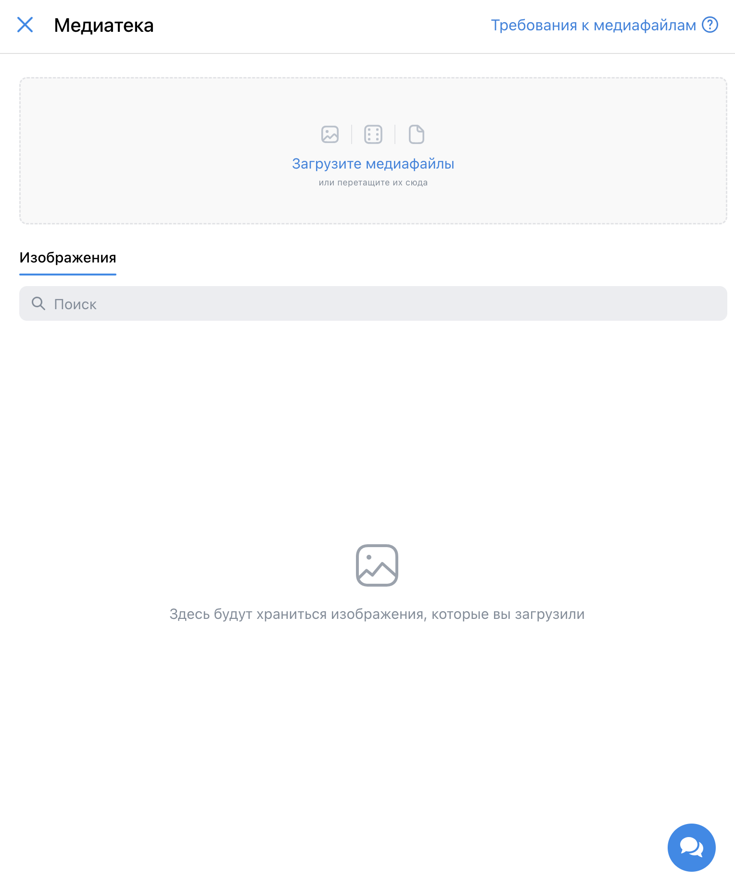
    - по-умолчанию загруженных файлов нет
    - при нажатии на кнопку `Загрузите медиафайлы` и выборе файла, он начинает загружаться в раздел `Изображения`
      - во время загрузки в левом верхнем углу файла отображается загрузочный сипннер, показываеющий степень загрузки файла
      - при успешной загрузке спиннер пропадает
      - при попытке загрузить изображение размером более чем 5MB ошибка `Медиафайл не был загружен, т.к. его размер больше чем 5MB`
      - при попытке загрузить изображение любого расширения кроме `.png` и `.jpg` слева снизу появляется ошибка `Не удалось загрузить файлы`
    - при нажатии на кнопку редактирования
      - снизу появляется кнопка `Отмена`, при нажатии на которую режим редактирования закрывается
      - при нажатии на кнопку `Выбрать все` выбираются все изображения
      - при выборе одного и более изображения снизу появляется кнопка `Удалить выбранные`, при нажатии на которую появляется модальное окно с подтверждением удаления
        - при нажатии на кнопку `Удалить` выбранные изображения удаляются
        - при нажатии на кнопку `Отмена` модальное окно закрывается, но режим редактирования остается
  - при нажатии на любое загруженное изображение модальное окно закрывается и логотип становится выбранным изображением, а рядом с ним появляются кнопки `Заменить` и `Кадрировать`
    - при нажатии на кнопку `Заменить` повторно открывается модальное окно `Медиатека`
    - при нажатии на кнопку `Кадрировать` появляется окно с кадрированием изображения
      - при любом отображения изображения сверху появляется сообщение `Изображение будет кадрировано`, а под потенциальным кадром появляются 2 кнопки: `Отменить` и `Применить`
        - при нажатии на кнопку `Применить` изменения применяются и изображение кадрируется, а справа сверху появляется кнопка `К оригиналу`
          - при нажатии на кнопку `К оригиналу` кадрирование отменяется
        - при нажатии на кнопку `Отменить` кадрирование отменяется
      - снизу 3 кнопки: `Выровнять по размеру`, `Отменить` и `Сохранить`
        - при нажатии на кнопку `Выровнять по размеру` изображение выравнивается по размеру, снизу появляется кнопка `Отменить`
          - при нажатии на кнопку `Отменить` выравнивание по размеру отменяется
        - при нажатии на кнопку `Отменить` все изменения отменяются и модальное окно закрывается
        - кнопка `Сохранить` кликабельна только при каком-либо изменении
        - при нажатии на кнопку `Сохранить` изменения сохраняются и модальное окно закрывается, кадрированное изображение становится логотипом
  - при выборе логотипа он отображается справа в превью формы
- `Название компании (организации)`
  - при оставлении пустым или заполненным одними пробелами появляется ошибка `Обязательное поле`
  - при заполнении более чем 30 символами появляется ошибка `Превышена максимальная длина поля`
  - в остальных случаях ошибок не возникает
  - при заполнении этого поля в превью формы справа отображается вводимое значение
- `Первый экран формы`
  - содержит три варианта выбора: `Компактный`, `Больше текста`, `Лид-магнит`
  - при выборе каждого из них поля ниже меняются в зависимости от выбранного типа, также меняется превью справа
  - `Компактный`
    - `Заголовок`
      - при оставлении пустым или заполненным одними пробелами появляется ошибка `Обязательное поле`
      - при заполнении более чем 50 символами появляется ошибка `Превышена максимальная длина поля`
      - в остальных случаях ошибок не возникает
      - при заполнении этого поля в превью формы справа отображается вводимое значение
    - `Описание опроса`
      - при оставлении пустым или заполненным одними пробелами появляется ошибка `Обязательное поле`
      - при заполнении более чем 35 символами появляется ошибка `Превышена максимальная длина поля`
      - в остальных случаях ошибок не возникает
      - при заполнении этого поля в превью формы справа отображается вводимое значение
  - `Больше текста`
    - `Заголовок`
      - при оставлении пустым или заполненным одними пробелами появляется ошибка `Обязательное поле`
      - при заполнении более чем 50 символами появляется ошибка `Превышена максимальная длина поля`
      - в остальных случаях ошибок не возникает
      - при заполнении этого поля в превью формы справа отображается вводимое значение
    - `Длинное описание (не более 2 переносов строк подряд)`
      - при оставлении пустым или заполненным одними пробелами появляется ошибка `Обязательное поле`
      - при заполнении более чем 350 символами появляется ошибка `Превышена максимальная длина поля`
      - при проставлении более чем 2-х переносов подряд возникает ошибка `Разрешено не более 2 переносов подряд`
      - в остальных случаях ошибок не возникает
      - при заполнении этого поля в превью формы справа отображается вводимое значение
  - `Лид-магнит`
    - `Заголовок`
      - при оставлении пустым или заполненным одними пробелами появляется ошибка `Обязательное поле`
      - при заполнении более чем 50 символами появляется ошибка `Превышена максимальная длина поля`
      - в остальных случаях ошибок не возникает
      - при заполнении этого поля в превью формы справа отображается вводимое значение
    - `Тип вознаграждения`
      - радио кнопки, поле ниже меняется в зависимости от выбранной
      - при выборе кнопки `Скидка`:
        - поле снизу `Размер скидки`
          - два варианта скидки: `₽` и `%`
          - при выборе `₽`
            - при попытке стереть значение в поле стоит `0` и появляется ошибка `Значение должно быть больше нуля`
            - при попытке заполнить одними нулями в поле остается только один нуль
            - в поле вносятся только цифры
            - при заполнении более чем 12 цифрами новые цифры не добавляются
            - в остальных случаях ошибок не возникает
            - при заполнении этого поля в превью формы справа отображается вводимое значение
          - при выборе `%`
            - при попытке стереть значение в поле стоит `0` и появляется ошибка `Значение должно быть больше нуля`
            - при попытке заполнить одними нулями в поле остается только один нуль
            - в поле вносятся только цифры
            - при вводе значения более `100` появляется ошибка `Запрещено указывать скидку более 100%`
            - при заполнении более чем 12 цифрами новые цифры не добавляются, при этом ошибка `Запрещено указывать скидку более 100%` остается
            - в остальных случаях ошибок не возникает
            - при заполнении этого поля в превью формы справа отображается вводимое значение
      - при выборе кнопки `Бонус`:
        - поле снизу `Описание бонуса`
          - при оставлении пустым или заполненным одними пробелами появляется ошибка `Обязательное поле`
          - при заполнении более чем 3 0 символами появляется ошибка `Превышена максимальная длина поля`
          - в остальных случаях ошибок не возникает
          - при заполнении этого поля в превью формы справа отображается вводимое значение
- `Стили`
  - можно выбрать один из предложенных цветов
  - при выборе цвета цвет формы превью меняется
- `Обложка`
  - при нажатии на кнопку `Добавить обложку` открывается окно `Медиатека`
  - при выборе изображения в качестве обложки, оно отображается справа на превью
    - в форме появляются кнопки `Заменить`, `Кадрировать` и `Удалить`
      - при нажатии на кнопку `Заменить` открывается окно `Медиатека`
      - при нажатии на кнопку `Кадрировать` открывается окно кадрирования
      - при нажатии на кнопку `Удалить` обложка удаляется

### Вопросы

Второй шаг `Оформление` выглядит следующим образом:

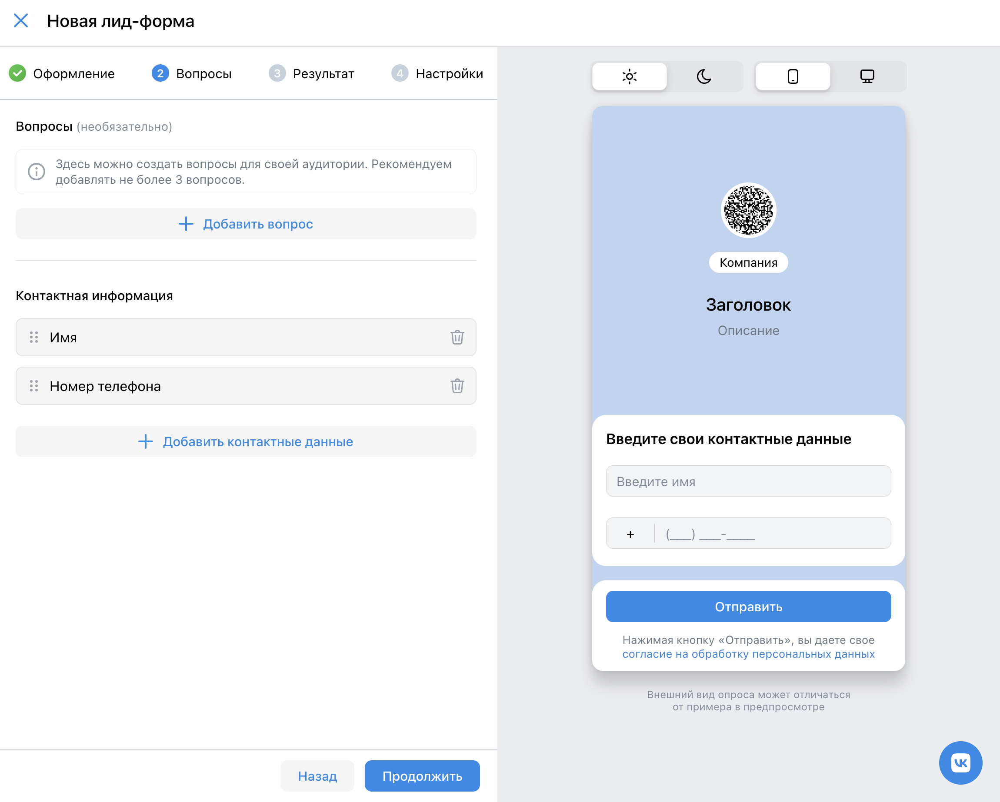

- снизу формы кнопки `Продолжить` и `Назад`
  - при нажатии на кнопку `Продолжить` происходит валидация форм
    - при наличии ошибок в соответствующих полях появляется сообщение об ошибке
    - в момент, когда ошибка исправлена, сообщение пропадает
    - при при отсутствии ошибок пользователь переходит на следующи шаг создания лид-формы
  - при нажатии на кнопку `Назад` внесенные изменения на текущем шаге сохраняются и пользователь переходит на предыдущий шаг
    - при дальнейшем возврате на этот шаг все внесенные данные возвращаются
- `Вопросы`
  - можно не заполнять
  - при возникновении ошибок уведомление об этом появляется в виде тултипа рядом с номером вопроса
  - при нажатии на кнопку `Добавить вопрос` появляется форма заполнения вопроса
  - можно добавить до 5 вопросов включительно и кнопка `Добавить вопрос` пропадает
    - `Напишите вопрос`
      - при оставлении пустым или заполненным одними пробелами возникает ошибка
      - при заполнении более чем 68 символами в поле остаются только первые 68 символов
      - в остальных случаях ошибок не возникает
      - при заполнении этого поля в превью формы справа отображается вводимое значение
    - `Тип вопроса`
      - выбор из трех вариантов: `Выбор одного ответа`, `Выбор нескольких ответов`, `Ответ в произвольной форме`
        - `Выбор одного ответа`
          - ответы отображаются в превью в виде радио кнопок
          - при нажатии на кнопку `Добавить ответ` добавляется новое поле ответа
          - при нажатии на кнопку `...` появляется дропдаун со стандартными вариантами ответов
          - можно добавить от двух до 7 ответов включительно
          - при наличии 3 ответов и более рядом с полями ответов появляются кнопки удаления ответов
          - при оставлении поля ответа пустым или заполненным одними пробелами возникает ошибка
          - при заполнении поля ответа более чем 40 символами в поле остаются только первые 40 символов
          - в остальных случаях ошибок не возникает
          - при заполнении этого поля в превью формы справа отображается вводимое значение
        - `Выбор нескольких ответов`
          - ответы отображаются в превью в виде чекбоксов
          - при нажатии на кнопку `Добавить ответ` добавляется новое поле ответа
          - при нажатии на кнопку `...` появляется дропдаун со стандартными вариантами ответов
          - можно добавить от двух до 7 ответов включительно
          - при наличии 3 ответов и более рядом с полями ответов появляются кнопки удаления ответов
          - при оставлении поля ответа пустым или заполненным одними пробелами возникает ошибка
          - при заполнении поля ответа более чем 40 символами в поле остаются только первые 40 символов
          - в остальных случаях ошибок не возникает
          - при заполнении этого поля в превью формы справа отображается вводимое значение
        - `Ответ в произвольной форме`
          - ответы отображаются в превью в виде текстового поля
  - при нажатии на кнопку удаления вопроса вопрос удаляется
- `Контактная информация`
  - при нажатии на кнопку `Добавить контактные данные` появляется модальное окно с чекбоксами возможных вариантов
  - при добавлении варианта соответствующий чекбокс исчезает из списка
  - при добавлении всех вариантов кнопка `Добавить контактные данные` пропадает
  - при нажатии на кнопку удаления варианта соответствующий пункт удаляется
  - при удалении всех пунктов появляется ошибка `Минимальное количество полей: 1`

### Результаты

Третий шаг `Результат` выглядит следующим образом:

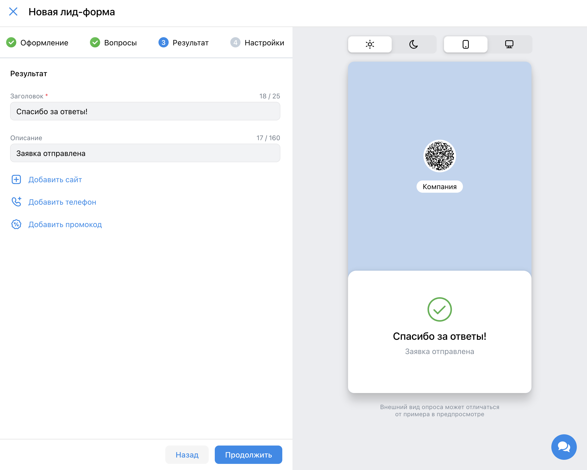

- снизу формы кнопки `Продолжить` и `Назад`
  - при нажатии на кнопку `Продолжить` происходит валидация форм
    - при наличии ошибок в соответствующих полях появляется сообщение об ошибке
    - в момент, когда ошибка исправлена, сообщение пропадает
    - при при отсутствии ошибок пользователь переходит на следующий шаг создания лид-формы
  - при нажатии на кнопку `Назад` внесенные изменения на текущем шаге сохраняются и пользователь переходит на предыдущий шаг
    - при дальнейшем возврате на этот шаг все внесенные данные возвращаются
- `Заголовок`
  - при оставлении пустым или заполненным одними пробелами появляется ошибка `Обязательное поле`
  - при заполнении более чем 25 символами появляется ошибка `Превышена максимальная длина поля`
  - в остальных случаях ошибок не возникает
  - при заполнении этого поля в превью формы справа отображается вводимое значение
- `Описание`
  - при оставлении пустым или заполненным одними пробелами появляется ошибка `Обязательное поле`
  - при заполнении более чем 160 символами появляется ошибка `Превышена максимальная длина поля`
  - в остальных случаях ошибок не возникает
  - при заполнении этого поля в превью формы справа отображается вводимое значение
- при нажатии на кнопку `Добавить сайт` появляется поле `Ссылка на сайт`
  - при оставлении поля пустым ошибок не возникает, справа на превью кнопка с url не отображается
  - в поле должен быть указан рабочий url, иначе появляется ошибка `Невалидный url`
  - кнопка с url на превью ведет по этому url
- при нажатии на кнопку `Добавить телефон` появляется поле `Телефон для заказа`
  - при оставлении поля пустым ошибок не возникает, справа на превью кнопка с телефоном не отображается
  - валидный телефон имеет формат `+<код страны><код оператора><уникальный номер>`:
    - `<код страны>` - международный код страны;
    - `<код оператора>` - 3 цифры, обозначающих название сотового оператора и регион регистрации номера;
    - `<уникальный номер>` - 7 уникальных цифр, номер абонента, по которому также можно определить регион.
  - при попытке ввести данные в любом другом формате, возникает ошибка `Телефон должен начинаться с + и содержать только цифры`
  - при попытке ввести более 14 символов в поле остаются только первые введенные 14 символов
- при нажатии на кнопку `Добавить промокод` появляется поле `Промокод`
  - при оставлении поля пустым ошибок не возникает, справа на превью поле с промокодом не отображается
  - при заполнении более чем 30 символами появляется ошибка `Превышена максимальная длина поля`
  - в остальных случаях ошибок не возникает
  - при заполнении этого поля в превью формы справа отображается вводимое значение
